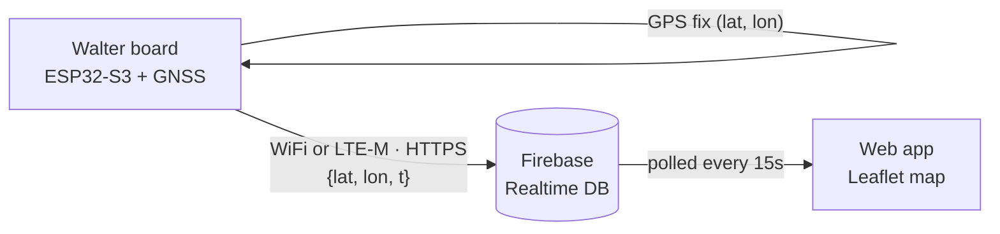

# Hermes


A GPS run-tracker that lets other people **spectate your run live** on a map — see your route, distance, elapsed time and pace update as you go, and browse past runs afterwards.

Built on the [DPTechnics Walter](https://www.dptechnics.com/en/products/walter.html) board (ESP32-S3 + Sequans GM02SP cellular modem with built-in GNSS). The device takes a GPS fix, pushes it to a Firebase Realtime Database, and a lightweight web app draws the route on a live map.

> **Status:** v1 (WiFi) working end-to-end — device gets a GNSS fix and streams position to the live map. Each run is now its own session in Firebase, writes are authenticated, and the web app can replay past runs. v2 (cellular) firmware has been written but is **not yet verified on real hardware** — see [Roadmap](#roadmap).

---

## How it works



1. **Firmware** on the Walter gets the time (NTP over WiFi in v1, the cellular network clock in v2), hands it to the modem's GNSS so it can fix without waiting on GPS almanac data alone, then takes a position fix every ~20 s.
2. On boot, the device signs in to **Firebase Auth anonymously**, starts a new **session** (one per run), and publishes that session's id as the live session.
3. Each fix is POSTed as `{lat, lon, t}` to `sessions/{sessionId}/points` in a **Firebase Realtime Database** over HTTPS, authenticated with the device's auth token.
4. The **web app** polls the live session every 15 s and redraws the route (a colour gradient from start to current position), computing total distance (haversine), elapsed time and pace from the point timestamps. A **History** panel lists past sessions and replays any of them on the same map.

## Hardware

- **DPTechnics Walter** — ESP32-S3 with a Sequans GM02SP modem (LTE-M / NB-IoT) and integrated GNSS (GPS + GLONASS)
- GNSS antenna (cellular antenna also needed for the v2 cellular build)
- A SIM with a data plan, for v2 only
- USB-C cable

## Repository layout

```
firmware/hermes_wifi/       Arduino sketch for the Walter (v1 - WiFi)
  hermes_wifi.ino             main firmware
  secrets.example.h           copy to secrets.h and fill in your details
firmware/hermes_cellular/   Arduino sketch for the Walter (v2 - LTE-M, unverified on hardware)
  hermes_cellular.ino         main firmware
  secrets.example.h           copy to secrets.h and fill in your details
firebase/database.rules.json  Realtime Database security rules
web/index.html               the live-tracking + run-history web app
```

## Setup

### 1. Firebase
1. Create a Firebase project with a Realtime Database.
2. Under **Authentication → Sign-in method**, enable the **Anonymous** provider (this is how the device authenticates its writes — no password to manage on-device).
3. Under **Project settings → General**, copy the **Web API Key** — you'll need it in `secrets.h`.
4. Publish `firebase/database.rules.json` as your database's rules (Realtime Database → Rules tab, or via the Firebase CLI). This allows public read (so anyone can spectate/browse history without logging in) but requires an authenticated write — see [Firebase security](#firebase-security).

### 2. Firmware
Pick one build:

**v1 — WiFi** (`firmware/hermes_wifi/`, works today):
1. Open `hermes_wifi.ino` in the Arduino IDE.
2. Install the **WalterModem** library (Library Manager) and the **esp32** boards package (Espressif). Select board **ESP32S3 Dev Module**, and set **USB CDC On Boot → Enabled**.
3. Copy `secrets.example.h` to `secrets.h` and fill in your WiFi, Firebase host and Firebase Web API key.
4. Connect the GNSS antenna, upload, and open the Serial Monitor at 115200. First fix outdoors can take a few minutes (cold start).

**v2 — Cellular** (`firmware/hermes_cellular/`, **unverified on real hardware** — see [Roadmap](#roadmap)):
1. Same library/board setup as v1, plus a SIM in the Walter's SIM slot and the cellular antenna connected.
2. Copy `secrets.example.h` to `secrets.h` and fill in your SIM's APN, Firebase host and Firebase Web API key.
3. Compile against your installed WalterModem library version first — the cellular/HTTP AT-command calls in this file were written from DPTechnics' published examples but haven't been compiled or flashed here, so expect to fix small API-signature mismatches before it builds.

### 3. Web app
Open `web/index.html` in a browser, or host it (e.g. GitHub Pages). Set `firebaseBase` near the top of the file to your own Firebase Realtime Database URL (`https://<host>`).

## Firebase security

Writes require Firebase Auth (the device signs in anonymously on boot and attaches its id token to every write); reads are public, since the whole point of Hermes is that anyone can spectate without an account. `firebase/database.rules.json` also validates the shape of what gets written (session points need numeric `lat`/`lon`/`t` in range; nothing else is accepted), so a stray or malicious write can't corrupt a session's data or add arbitrary fields.

## Known limitations

- **v2 cellular firmware is unverified** — written against WalterModem's documented API but not compiled or tested on hardware in this environment. Treat it as a strong starting point, not a working build, until you've flashed and tested it.
- **Slow first fix on v1** — WiFi-only v1 skips cellular GNSS assistance data, so a cold start outdoors can take a few minutes; later fixes are quicker. v2's cellular connection should make this much faster once verified.
- **TLS** — the firmware currently skips certificate validation for simplicity (both v1's `WiFiClientSecure::setInsecure()` and v2's `WALTER_MODEM_TLS_VALIDATION_NONE`); pinning/validating the Firebase cert is a future hardening step.
- **History list cost** — the web app's history panel fetches one small `meta` record per past session to list them; with a very large number of runs this is a lot of small requests. Fine at hobby-project scale; would want pagination or a summary index before that stops being true.

## Roadmap

- [x] **v1 — WiFi:** GNSS fix + stream to live map
- [x] **Real session history:** each run gets its own session instead of a single live buffer; the web app can list and replay past runs
- [x] **Lock down Firebase security rules + authenticated writes:** anonymous Firebase Auth on-device, auth-required writes, public read, schema-validated rules
- [ ] **v2 — Cellular (LTE-M):** firmware written (`firmware/hermes_cellular/`) but needs compiling against a real WalterModem install and testing outdoors on hardware before it's trustworthy
- [ ] Battery + enclosure for a wearable form factor

## Tech

Arduino / C++ · ESP32-S3 · WalterModem · Firebase Realtime Database + Auth · Leaflet · JavaScript

## License

MIT — see [LICENSE](LICENSE).
